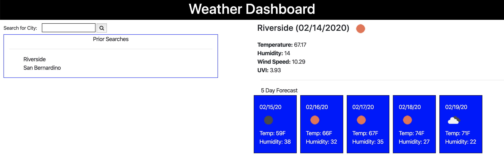

# WeatherDashboard
This is a Weather Dashboard that allows you to search for current weather conditions and a 5 day forecast.  So

As a traveler to different places, I want to lookup the weather outlook for various cities that I'll visit so I may plan accordingly.

This application uses the OpenWeather API to gather the weather data for a given city.  Following is how to use the application:

1.  Enter a city that you'd like to search for.
2.  Pres the search button.
3.  The weather information will load for the current day and 5 day forecast.

Please refer to the picture below for a visual of what to expect.

